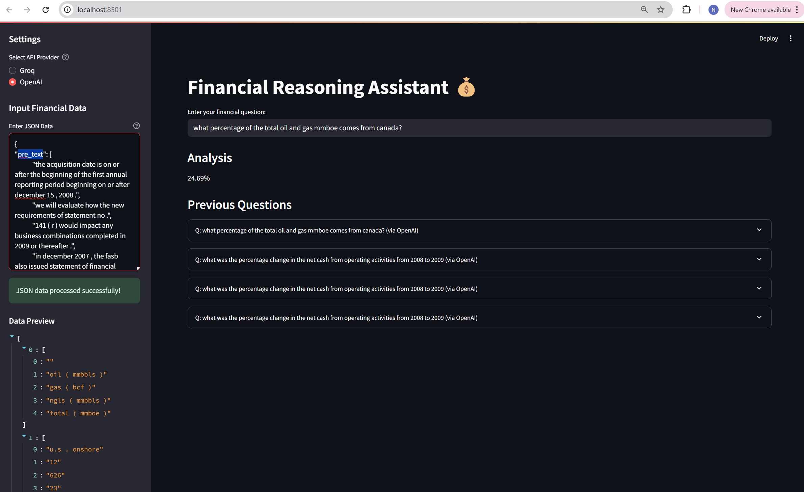

# Financial Reasoning Assistant

A sophisticated financial data analysis application that uses state-of-the-art Language Models (LLMs) to answer questions about financial data. The application supports both OpenAI's GPT-4 and Groq's LLM APIs for processing queries.

## Features

- Interactive web interface using Streamlit
- Support for both OpenAI and Groq LLMs
- Real-time financial data analysis
- JSON data processing capabilities
- Answer normalization for accurate comparisons
- Comprehensive evaluation system
- Performance metrics and reporting

## Prerequisites

- Python 3.8 or higher
- OpenAI API key
- Groq API key
- pip or conda for package management

## Installation

1. Clone the repository:
```bash
git clone https://github.com/ninja1420/FinExpert.git
cd FinExpert
```

2. Create and activate a virtual environment (recommended):
```bash
# Using venv
python -m venv venv
source venv/bin/activate  # On Windows: venv\Scripts\activate

# Or using conda
conda create -n finexpert python=3.12
conda activate finexpert
```

3. Install required packages:
```bash
pip install -r requirements.txt
```

4. Set up environment variables:
Create a `.env` file in the project root with your API keys:
```
OPENAI_API_KEY=your_openai_key_here
GROQ_API_KEY=your_groq_key_here
```

## Running the Application

1. Start the Streamlit application:
```bash
streamlit run app.py
```

2. Access the application in your web browser (typically http://localhost:8501)

3. Using the application:
   - Choose your preferred LLM provider (OpenAI or Groq)
   - Input your financial data in JSON format
   - Ask questions about the data
   - View analysis results and chat history
   


## Evaluation Dataset

The evaluation was performed using the ConvFinQA dataset ([GitHub Repository](https://github.com/czyssrs/ConvFinQA)), a comprehensive dataset for conversational financial question answering from EMNLP 2022. The dataset includes:

### Dataset Statistics
- Training set: 3,037 conversations (11,104 question turns)
- Development set: 421 conversations (1,490 question turns)
- Test set: 434 conversations (1,521 question turns)

### Data Format
Each entry in the dataset contains:
- Pre-text and post-text context
- Financial tables
- Question-answer pairs
- Ground truth programs for numerical reasoning

The dataset is particularly suited for evaluating:
- Numerical reasoning capabilities
- Financial context understanding
- Multi-turn conversation handling
- Answer accuracy and precision

## Running the Evaluation

The evaluation script tests the model's performance on the ConvFinQA dataset:

1. Prepare your evaluation data:
   - Place the test data in `Data/data/dev.json`
   - Ensure the JSON format matches the ConvFinQA structure

2. Run the evaluation:
```bash
python evaluation.py
```

The evaluation will:
- Process each question in the dataset
- Compare predicted answers with actual answers
- Calculate accuracy metrics
- Generate a detailed performance report

## Data Format

### Input JSON Structure
```json
{
    "pre_text": "Optional context before the data",
    "post_text": "Optional context after the data",
    "table": {
        // Financial data in key-value pairs
    },
    "qa": {
        "question": "The financial question",
        "answer": "The expected answer"
    }
    // Or multiple questions:
    "qa_0": {
        "question": "First question",
        "answer": "First answer"
    },
    "qa_1": {
        "question": "Second question",
        "answer": "Second answer"
    }
}
```

## Evaluation Results

The evaluation generates:
- Accuracy metrics
- Processing success rates
- Error analysis
- Detailed performance report

Find the results in:
- `evaluation_results.json`: Raw evaluation data

## Troubleshooting

1. API Key Issues:
   - Ensure your `.env` file is in the correct location
   - Verify API keys are valid and properly formatted
   - Check environment variable loading in your terminal

2. Data Format Issues:
   - Verify JSON structure matches the expected format
   - Check for valid numerical values in financial data
   - Ensure questions and answers are properly formatted


